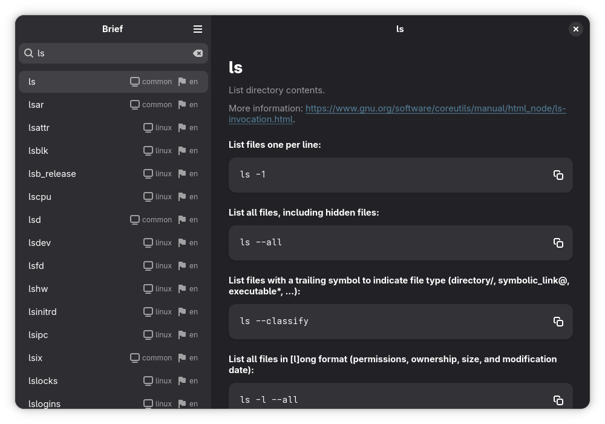

# Brief

**Browse command-line cheatsheets**

## Description

Brief is an app for browsing command-line cheatsheets written in Python, using GTK4 and Libadwaita. The data source is [tldr-pages](https://github.com/tldr-pages/tldr). It lets you search through thousands of command-line tools across multiple platforms and languages, providing simplified help pages.

## Features

- Works completely offline.
- Filter platform specific commands (Linux, Windows, Android, etc.).
- View command help pages in multiple available languages.
- Change the command argument format between long (`ls --all`) or short (`ls -a`).
- Lets you update the cache within the app to download the latest data.

## Install

## Development

You can clone this project and run it using [Gnome Builder](https://apps.gnome.org/Builder/). The Python libraries used in this project are defined inside [requirements.txt](./requirements.txt), which you may install if you want editor completions.

## Credits

The entirety of the data used in this project is from [tldr-pages](https://github.com/tldr-pages/tldr) and without their valuable work, this project wouldn't exist.
